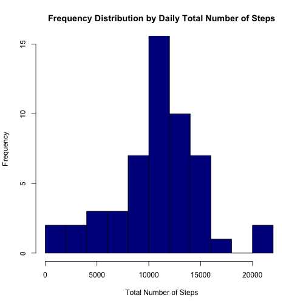
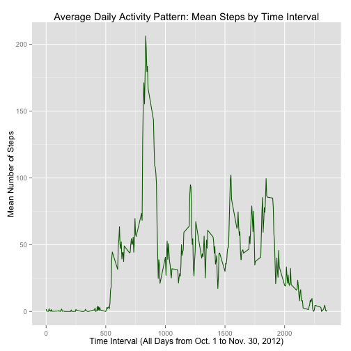
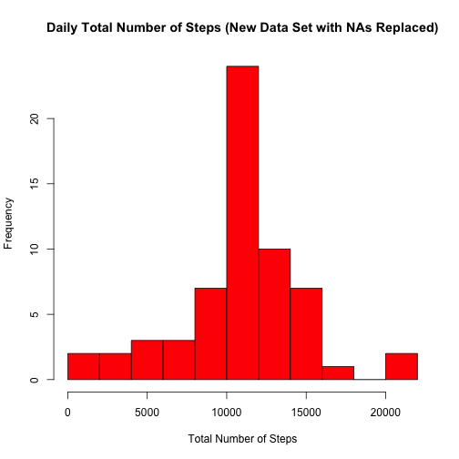

## Assignment Overview

This assignment makes use of data from a personal activity monitoring device. This device collects data at 5 minute intervals through out the day. The data consists of two months of data from an anonymous individual collected during the months of October and November, 2012 and include the number of steps taken in 5 minute intervals each day.

The data for this assignment was downloaded from the course web site:

Dataset: Activity monitoring data 

The variables included in this dataset are:

    steps: Number of steps taking in a 5-minute interval (missing values are coded as NA)

    date: The date on which the measurement was taken in YYYY-MM-DD format

    interval: Identifier for the 5-minute interval in which measurement was taken

The dataset is stored in a comma-separated-value (CSV) file and there are a total of 17,568 observations in this dataset.

## Loading and Processing Data


```r
# Setting the proper directory to the folder "RepData_PeerAssessment1"
setwd("~/RepData_PeerAssessment1")
# Reading the data and converting variable "date" into "Date" format
activity <- read.csv(file="activity.csv", head=TRUE, sep=",")
activity$date <- as.Date(as.character(activity$date, format="%y-%m-%d"))
```

## What is mean total number of steps taken per day?

Before calculating the mean total number of steps taken per day, I first need to aggregate the total of steps taken on each day from the acitivty dataset:

```r
# Calculating the daily total of the number of steps taken
activity_sum <- aggregate(activity$steps, by=list(Day=activity$date), FUN=sum)
```

Then, I created a histogram to show the frequency distribution of observations by the daily total number of steps using the following codes. Professor Peng made a point to remind us the difference between a histogram and a barplot. Our friendly community TA helps us understand the difference in this course [discussion thread.](https://class.coursera.org/repdata-034/forum/thread?thread_id=27) 

Note that I set the number of breaks to 10 for this specific histogram instead of using the default for the HIST command in R. Because of this, my historgram might look different from those created by other students. 


```r
# Creating a histogram to show the frequency of observations by the daily total number of steps
hist(activity_sum$x, col="darkblue", 
     main="Frequency Distribution by Daily Total Number of Steps", 
     xlab="Total Number of Steps", ylab="Frequency", xlim=c(0, 22500), ylim=c(0, 15), breaks=10)
```

 

Finally, I calculated the measures of central tendency - the mean and the median - of the total number of steps per day. 

```r
# Calculating the mean and median of the daily total number of steps
mean <- mean(activity_sum$x, na.rm=TRUE)
median <- median(activity_sum$x, na.rm=TRUE)
```
The mean and the medians are as follow:

```
## [1] 10766.19
```

```
## [1] 10765
```

## What is the average daily activity pattern?

In order to show the average daily activity pattern, I need to first calculate the mean number of steps from each time interval across the days within the period of the study (Oct. 1 to Nov. 30, 2012). I use the aggregate function for this task:


```r
# Plotting the Mean Number of Steps from Each Time Interval (aggregated across all days)
activity_interval <- aggregate(activity$steps, by=list(Interval=activity$interval), FUN=mean, na.rm=TRUE)
```

And then, I used the ggplot package to create the time-series plot to show the average daily acitivty pattern by time interval.


```r
library(ggplot2)
ggplot(activity_interval, aes(x=Interval, y=x)) + geom_line(color="darkgreen") +
  labs(title="Average Daily Activity Pattern: Mean Steps by Time Interval") +
  labs(x="Time Interval (All Days from Oct. 1 to Nov. 30, 2012)") + labs(y="Mean Number of Steps")
```

 

Now, I need to find the 5-minute interval that contains the maximum number of steps across all days.

```r
# Finding out what the maximum of the mean number of steps is
max_mean <- max(activity_interval$x, na.rm=TRUE)
```
The maximum number of steps is:

```
## [1] 206.1698
```
And, **the 5-minute interview that contains the maxium number of steps is:**

```r
activity_interval$Interval[activity_interval$x==max_mean]
```

```
## [1] 835
```

## Imputing missing values
This data includes a considerable number of missing values. The number of observations can be obtained by using the following codes:

```r
# Calculating the number of cases with missing values
incomplete_case <- sum(!complete.cases(activity))
```
The number of observations that contain missing values (coded as NA) is:

```
## [1] 2304
```
I looked at the "activity" data set as well as some of the aggregated data created earlier for this assignment. I noticed that the missing values came from a number of days in which data on steps taken were completely missing. In order to preserve the variabilty of daily pattern of activity, I decided to use the mean step taken from each 5-minute time interval to subsitute for the missing value (NA) in which observation: 

```r
# Creating a new data set "activity_nm" by substituting the mean value of steps by intervial for NA 
activity_nm <- activity
interval_means <- aggregate(activity_nm$steps, by=list(Interval=activity$interval), FUN="mean", na.rm=TRUE)
colnames(interval_means)[colnames(interval_means)=="x"] <- "Interval_Mean"
for(interval in unique(activity_nm$interval)){
  activity_nm$steps[activity_nm$interval==interval & is.na(activity_nm$steps)] <- mean(activity_nm$steps[activity_nm$interval==interval], na.rm=TRUE)
}
```
You can see what the new data set "activity_nm" looks like:

```
##       steps       date interval
## 1 1.7169811 2012-10-01        0
## 2 0.3396226 2012-10-01        5
## 3 0.1320755 2012-10-01       10
## 4 0.1509434 2012-10-01       15
## 5 0.0754717 2012-10-01       20
## 6 2.0943396 2012-10-01       25
```

```
##           steps       date interval
## 17563 2.6037736 2012-11-30     2330
## 17564 4.6981132 2012-11-30     2335
## 17565 3.3018868 2012-11-30     2340
## 17566 0.6415094 2012-11-30     2345
## 17567 0.2264151 2012-11-30     2350
## 17568 1.0754717 2012-11-30     2355
```
To be sure, let's check to see if all the NAs are gone in the new data set "activity_nm" using the following codes:

```r
# Calculating the number of cases with missing values
incomplete_case2 <- sum(!complete.cases(activity_nm))
```
After subsituting the NAs with the interval mean values, the number of observations that contain missing values in the new data set is now zero:

```r
incomplete_case2
```

```
## [1] 0
```

We are asked to create a histogram of the total number of steps taken each day with the new data set:

```r
# Calculating the daily total of the number of steps taken
activity_nm_sum <- aggregate(activity_nm$steps, by=list(Day=activity_nm$date), FUN=sum)

# Creating a histogram to show the frequency of observations by the daily total number of steps
hist(activity_nm_sum$x, col="red", 
     main="Daily Total Number of Steps (New Data Set with NAs Replaced)", 
     xlab="Total Number of Steps", ylab="Frequency", breaks=10)
```

 


And also to calculate the mean and median total number of steps taken per day.

```r
mean <- mean(activity_nm_sum$x, na.rm=FALSE)
median <- median(activity_nm_sum$x, na.rm=FALSE)
```
Here are the mean and the median respectively:

```
## [1] 10766.19
```

```
## [1] 10766.19
```
You might notice that the mean is actually the same as the mean obtained for the original dataset. The median, however, is slightly different. 

## Are there differences in activity patterns between weekdays and weekends?
Now, we are in the last section of this assignment. We are asked to separate the data into weekdays and weekends so that we can compare their activity patterns. The following are the codes to perform this task:

```r
# Creating a new variable "activity_nm$week" from the "date" variable to indicate the day of the week
activity_nm$week <- "Weekday"
activity_nm$day <- weekdays(as.Date(activity_nm$date))
activity_nm$week[which(activity_nm$day=="Saturday")] <-"Weekend" 
activity_nm$week[which(activity_nm$day=="Sunday")] <-"Weekend"
```
Next, I need to aggregate the data in order to obtain the mean steps taken in each 5-minute interval during weekends and weekdays through the duration of the observation period (Oct. 1 to Nov. 30, 2012):

```r
# Calculating the Mean Number of Steps in Each Time Interval (aggregated across all days)
activity_week <- aggregate(activity_nm$steps, by=list(Interval=activity_nm$interval, Day=activity_nm$week), FUN=mean, na.rm=TRUE)
```
And then, from the aggregated data, I used the ggplot package to create the panel plot that contains the two time-series charts for weekday and weekend respectively:

```r
library(ggplot2)
ggplot(activity_week, aes(x=Interval, y=x, fill=Day)) + geom_line(color="blue") +
     labs(title="Average Daily Activity Pattern: Mean Steps by Time Interval") +
     labs(x="Time Interval (All Days from Oct. 1 to Nov. 30, 2012)") + labs(y="Mean Number of Steps") +
    facet_grid(Day ~ ., scales="fixed", space="free")
```

 


**This concludes our Peer Assignment #1 for the Reproducible Research course. I hope I have made it clear to you the steps I went through to complete this assignment and the logic behind my decisions. Thank you very much for reviewing my assignment, and your feedback will be greatly appreciated!**
